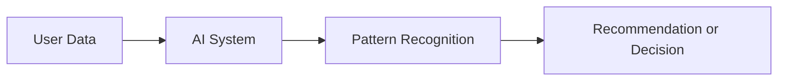

# Artificial Intelligence

## What is Artificial Intelligence?

Artificial Intelligence, commonly called **AI**, is the ability of a computer or software system to perform tasks that normally require human intelligence.

These tasks may include learning from information, understanding patterns, making decisions, solving problems, predicting outcomes, and recommending relevant content.

In simple terms, AI helps computers behave in a more intelligent way.

## AI in everyday life

### YouTube

YouTube recommends videos based on your previous watch history and interests.

### Instagram

Instagram studies the type of posts and reels you interact with and then shows similar content.

### Swiggy and Zomato

Food-delivery applications can recommend restaurants and dishes based on your previous orders and preferences.

## Key takeaway

AI uses information and learned patterns to produce useful decisions, predictions, or recommendations.

[← Module Home](README.md) | [Next: Machine Learning →](02-machine-learning.md)
