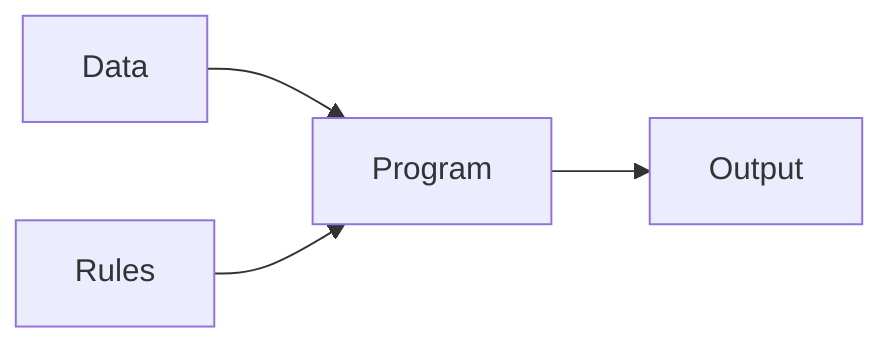
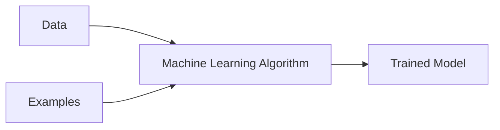
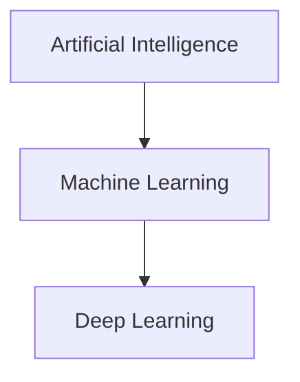

# Machine Learning

## What is Machine Learning?

**Machine Learning (ML)** is a branch of Artificial Intelligence that allows computers to learn from data.

Instead of giving the computer every rule manually, we provide data and examples. The system studies those examples, identifies patterns, and uses the learned patterns to make predictions.

## Traditional programming

A developer provides data and rules, and the program produces an output.

## Machine Learning

We provide data and examples. The algorithm learns the pattern and creates a trained model.

## Example: YouTube recommendations

If you regularly watch cricket, technology, and DevOps videos, YouTube studies this history and recommends similar content.

## Relationship between AI, ML, and Deep Learning

- **AI** is the broader field.
- **ML** enables systems to learn from data.
- **Deep Learning** uses Neural Networks with multiple layers.

[← Artificial Intelligence](01-artificial-intelligence.md) | [Module Home](README.md) | [Next: How ML Works →](03-how-machine-learning-works.md)
