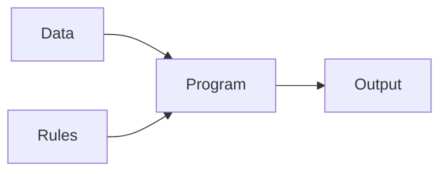
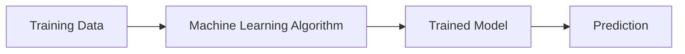
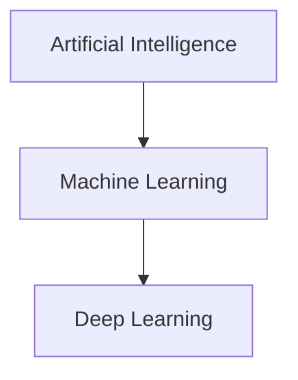

# Machine Learning (ML)

## Learning Objectives

By the end of this chapter, you will be able to:

- Understand what Machine Learning is.
- Explain how Machine Learning differs from traditional programming.
- Describe how machines learn from data.
- Understand the relationship between AI, Machine Learning, and Deep Learning.

---

# What is Machine Learning?

Machine Learning (ML) is a subset of Artificial Intelligence (AI) that enables computers to learn from data without being explicitly programmed for every scenario.

Instead of manually writing every rule, we provide data to a Machine Learning algorithm. The algorithm identifies patterns, learns from the data, and builds a model that can make predictions on new data.

---

# Traditional Programming vs Machine Learning

## Traditional Programming

In traditional programming:

- The developer writes the rules.
- Data is given to the program.
- The program produces the output.

---

## Machine Learning

In Machine Learning:

- Data is provided to the algorithm.
- The algorithm learns patterns.
- A trained model is created.
- The trained model predicts future results.

---

# Real-World Example

Imagine you watch:

- Cricket videos
- DevOps tutorials
- AWS content

YouTube studies your watch history and learns your interests.

The next time you open YouTube, it recommends similar videos.

Instead of manually writing rules for every user, the Machine Learning model continuously learns from user behavior.

---

# AI vs Machine Learning vs Deep Learning

- **Artificial Intelligence** is the broad field.
- **Machine Learning** is a subset of AI.
- **Deep Learning** is a subset of Machine Learning.

---

# Key Points

- Machine Learning allows computers to learn from data.
- ML identifies patterns automatically.
- ML models improve their predictions as more data becomes available.
- Recommendation systems, fraud detection, spam filtering, and image recognition all use Machine Learning.

---

# Quick Revision

- What is Machine Learning?
- How is Machine Learning different from traditional programming?
- Give one real-world example of Machine Learning.
- Explain the relationship between AI, ML, and Deep Learning.

---

# Summary

Machine Learning is one of the most important areas of Artificial Intelligence. Instead of relying only on manually written rules, ML systems learn from historical data and use that knowledge to make predictions and intelligent decisions.

---

## Next Topic

➡️ [How Machine Learning Works](03-how-machine-learning-works.md)
