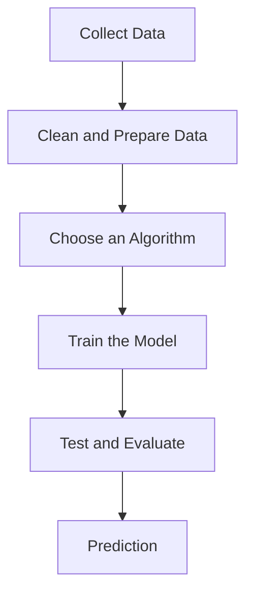

# How Machine Learning Works

A Machine Learning system is built through a sequence of steps.

## 1. Collect data

Gather relevant information such as watch history, search history, likes, clicks, previous orders, or user preferences.

## 2. Prepare the data

Clean and organize raw data so the algorithm can learn from it effectively.

## 3. Choose an algorithm

Select an algorithm based on whether the goal is prediction, classification, grouping, or recommendation.

## 4. Train the model

The algorithm studies the data and learns patterns. The result is called a **trained model**.

## 5. Test and evaluate

Test the model using data it did not see during training.

## 6. Make predictions

Use the trained model with new information to produce a prediction or recommendation.

> **Data → Learning Algorithm → Trained Model → Prediction**

[← Machine Learning](02-machine-learning.md) | [Module Home](README.md) | [Next: Types of ML →](04-types-of-machine-learning.md)
