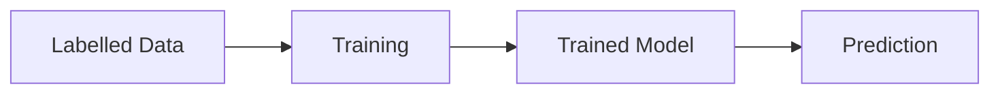
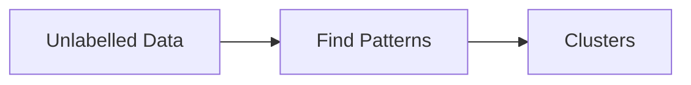
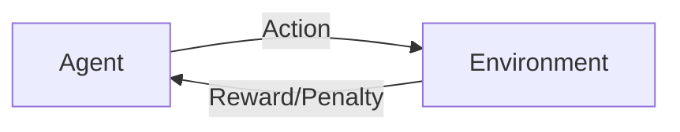

# Types of Machine Learning

## Learning Objectives

By the end of this chapter, you will be able to:

- Understand the three major types of Machine Learning.
- Differentiate Supervised, Unsupervised, and Reinforcement Learning.
- Identify real-world use cases for each learning type.

---

# Overview

Machine Learning algorithms are generally classified into three categories:

1. Supervised Learning
2. Unsupervised Learning
3. Reinforcement Learning

Each type learns differently depending on the available data.

---

# 1. Supervised Learning

Supervised Learning uses **labelled data**.

This means the algorithm is trained using input data along with the correct output.

## Example

Email Classification

Input:

- Email Content

Output:

- Spam
- Not Spam

The model learns from thousands of labelled emails and predicts whether a new email is spam.

### Common Use Cases

- Spam Detection
- House Price Prediction
- Disease Prediction
- Loan Approval
- Customer Churn Prediction

---

# 2. Unsupervised Learning

Unsupervised Learning works with **unlabelled data**.

There is no correct answer provided.

The algorithm discovers hidden patterns or groups in the data.

## Example

Customer Segmentation

Customers are grouped based on:

- Purchase history
- Spending habits
- Interests

### Common Use Cases

- Customer Segmentation
- Recommendation Systems
- Market Basket Analysis
- Anomaly Detection

---

# 3. Reinforcement Learning

Reinforcement Learning learns through interaction with an environment.

The model performs actions and receives:

- Rewards
- Penalties

The objective is to maximize long-term rewards.

### Common Use Cases

- Self-driving Cars
- Robotics
- Game Playing (Chess, Go)
- Route Optimization

---

# Comparison

| Learning Type | Training Data       | Goal                      |
| ------------- | ------------------- | ------------------------- |
| Supervised    | Labelled            | Predict outcomes          |
| Unsupervised  | Unlabelled          | Discover patterns         |
| Reinforcement | Rewards & Penalties | Learn through interaction |

---

# Key Points

- Supervised Learning requires labelled data.
- Unsupervised Learning discovers hidden patterns.
- Reinforcement Learning improves using rewards and penalties.

---

# Quick Revision

- What is labelled data?
- What is clustering?
- What is a reward in Reinforcement Learning?
- Give one example of each learning type.

---

# Summary

Machine Learning can be divided into Supervised, Unsupervised, and Reinforcement Learning. Each approach is suited for different types of problems and datasets.

---

## Next Topic

➡️ Neural Networks & Deep Learning
