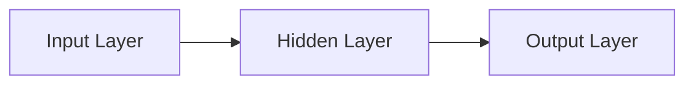
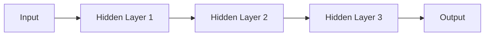
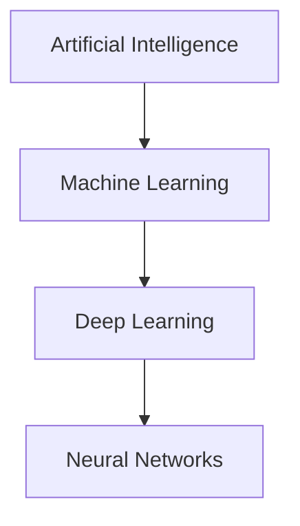

# Neural Networks and Deep Learning

## Learning Objectives

By the end of this chapter, you will be able to:

- Understand what a Neural Network is.
- Learn the structure of a Neural Network.
- Understand how Deep Learning extends Machine Learning.
- Explain the relationship between AI, ML, Neural Networks, and Deep Learning.

---

# What is a Neural Network?

A Neural Network is a computational model inspired by the human brain.

It consists of interconnected nodes called **neurons**, which work together to learn patterns from data.

Neural Networks are the foundation of modern Deep Learning systems.

---

# Basic Structure of a Neural Network

A Neural Network typically consists of three types of layers:

1. Input Layer
2. Hidden Layer(s)
3. Output Layer

---

## Input Layer

The input layer receives the data.

Examples include:

- Images
- Text
- Audio
- Sensor data

---

## Hidden Layer

The hidden layer performs mathematical calculations to identify patterns in the input data.

A network may contain one or many hidden layers.

More hidden layers generally allow the model to learn more complex relationships.

---

## Output Layer

The output layer produces the final prediction.

Examples:

- Spam / Not Spam
- Cat / Dog
- Fraud / Genuine
- House Price

---

# What is Deep Learning?

Deep Learning is a specialized area of Machine Learning that uses Neural Networks with multiple hidden layers.

The term **Deep** refers to the presence of many hidden layers.

---

# AI vs ML vs Deep Learning

- Artificial Intelligence is the broadest field.
- Machine Learning is a subset of AI.
- Deep Learning is a subset of Machine Learning.
- Deep Learning is powered by Neural Networks.

---

# Real-World Applications

Deep Learning is widely used in:

- ChatGPT
- Google Translate
- Face Recognition
- Self-driving Cars
- Medical Image Analysis
- Speech Recognition

---

# Key Points

- Neural Networks are inspired by the human brain.
- They contain Input, Hidden, and Output layers.
- Deep Learning uses multiple hidden layers.
- Deep Learning powers many modern AI applications.

---

# Quick Revision

- What is a Neural Network?
- What are the three layers of a Neural Network?
- Why is it called Deep Learning?
- Give three real-world applications of Deep Learning.

---

# Summary

Neural Networks form the foundation of Deep Learning. By stacking multiple hidden layers, Deep Learning models can learn highly complex patterns and solve problems such as image recognition, speech recognition, and language understanding.

---

## Next Module

➡️ Generative AI
