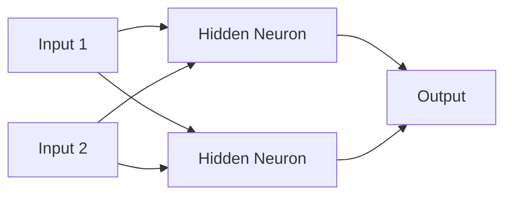

# Neural Networks and Deep Learning

## What is a Neural Network?

A **Neural Network** is a computing model inspired by the way the human brain processes information.

It contains connected units called neurons or nodes, organized into layers.

## Basic structure

1. **Input Layer**
2. **Hidden Layer**
3. **Output Layer**



A neuron receives inputs, applies weights, performs a calculation, uses an activation function, and sends an output forward.

```text
Inputs → Weights → Calculation → Activation Function → Output
```

## What is Deep Learning?

Deep Learning is a specialized area of Machine Learning that uses Neural Networks with multiple hidden layers.


The word **deep** refers to the presence of multiple processing layers.

[← Types of ML](04-types-of-machine-learning.md) | [Module Home](README.md)
